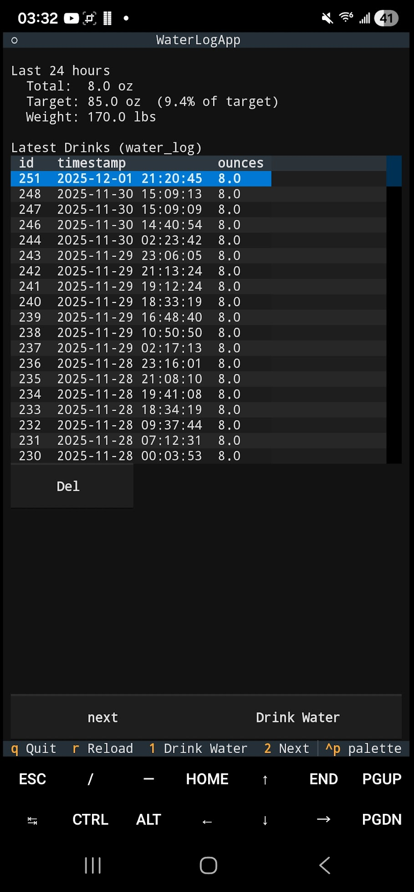
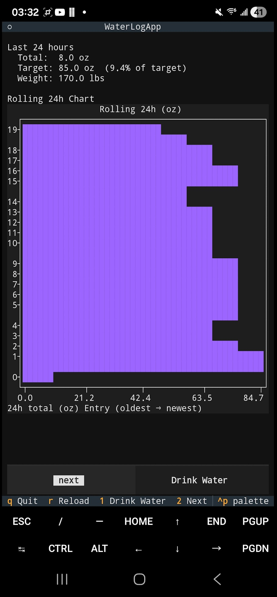
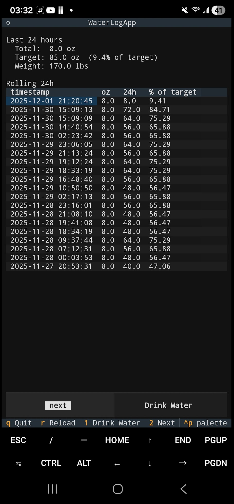

# Installation

```
uv pip install "git+https://github.com/dharmatech/sqlite-water-tracker.py"
```

# Termux

On termux, you'll need `python` and `uv`:

```
pkg install python
pkg install uv
```

# Videos

https://youtu.be/qt_PNr1Wz1Q

Older video:

https://youtu.be/sTj1FalZMVw